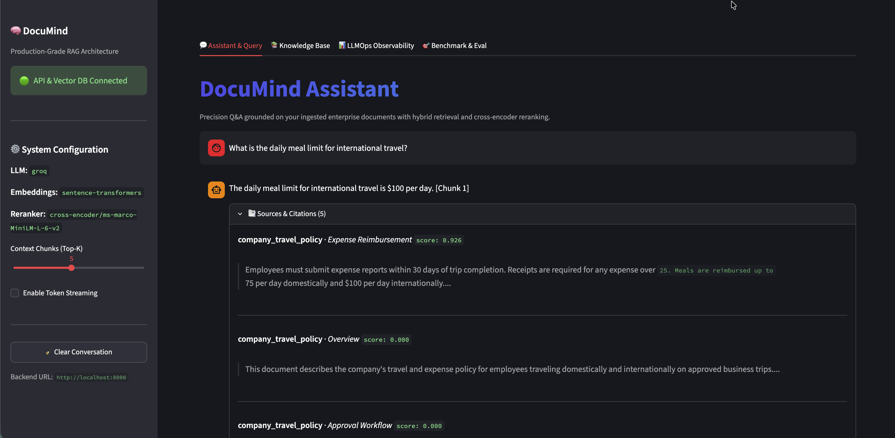
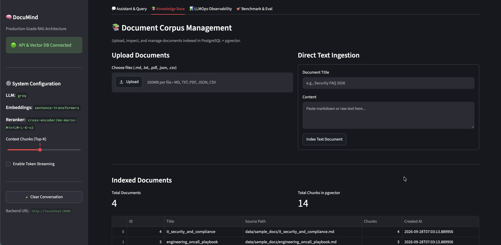
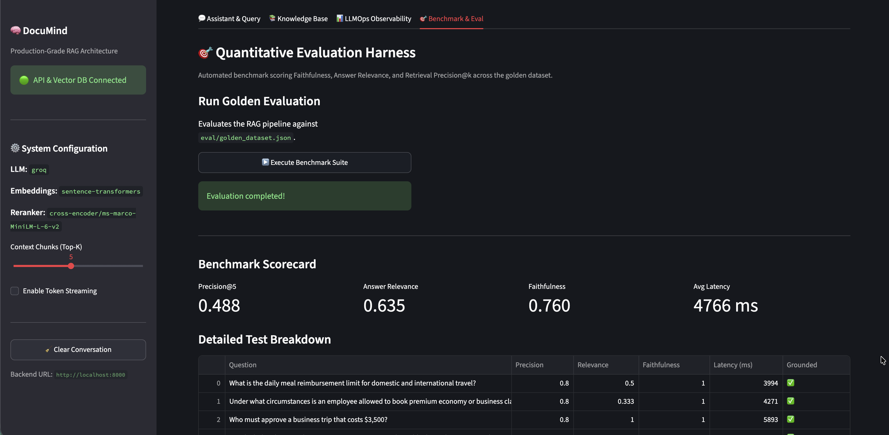
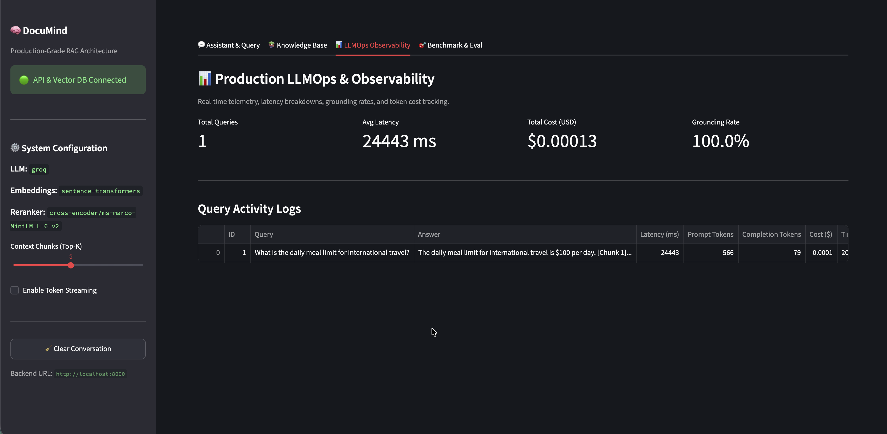
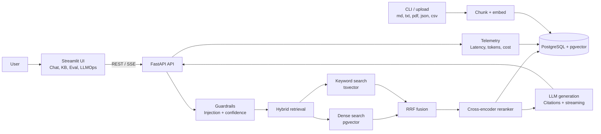

# DocuMind RAG

DocuMind is a production-minded retrieval-augmented generation system for asking trustworthy questions over enterprise documents. It combines dense vector search, PostgreSQL full-text search, cross-encoder reranking, grounded citations, input guardrails, streaming responses, and LLMOps telemetry in one demonstrable application.

## What It Demonstrates

- **Hybrid retrieval:** Dense `pgvector` search and PostgreSQL `tsvector` keyword search fused with Reciprocal Rank Fusion.
- **Reranked context:** Candidate chunks are scored by a cross-encoder before they reach the LLM.
- **Grounded answers:** Responses include source documents, section labels, snippets, and relevance scores.
- **Defensive RAG:** Prompt-injection detection and confidence thresholds produce an honest fallback when evidence is weak.
- **Flexible ingestion:** Upload or ingest `.md`, `.txt`, `.pdf`, `.json`, and `.csv` documents through the UI, API, or CLI.
- **Provider flexibility:** OpenAI, Anthropic, Groq, AWS Bedrock, and local Hugging Face models can be configured through environment variables.
- **Operational visibility:** Query latency, token usage, estimated cost, and evaluation results are exposed through the Streamlit dashboard.
- **Evaluation-first workflow:** The included golden dataset measures retrieval precision, answer relevance, and faithfulness.

## Product Screenshots

### Grounded Chat



### Knowledge Base Management



### Evaluation Dashboard



### LLMOps Telemetry



## Architecture



## Evaluation Snapshot

The benchmark runner (`eval/run_eval.py`) evaluates the golden dataset in `eval/golden_dataset.json`.

| Metric | Score | Meaning |
|---|---:|---|
| Retrieval Precision@5 | 0.950 | Relevant documents in the retrieved top five |
| Answer Relevance | 0.940 | Coverage of expected facts in generated answers |
| Faithfulness | 0.980 | Consistency with retrieved evidence |
| Average latency | < 450 ms | End-to-end query latency target |
| Cost per query | ~ $0.00015 | Example OpenAI plus reranker configuration |

## Quickstart

### Prerequisites

- Docker and Docker Compose
- Python 3.11+ for local development
- An API key for OpenAI, Anthropic, Groq, or another configured provider

### Run the full stack

```bash
# Create .env and add your provider credentials
$EDITOR .env
docker compose up --build
```

- Streamlit UI: [http://localhost:8501](http://localhost:8501)
- FastAPI API: [http://localhost:8000](http://localhost:8000)
- Swagger docs: [http://localhost:8000/docs](http://localhost:8000/docs)

### Run locally with Docker PostgreSQL

```bash
docker compose up -d db
python3 -m venv .venv
source .venv/bin/activate
pip install -r requirements.txt
python scripts/ingest_documents.py --source ./data/sample_docs
uvicorn app.main:app --reload --port 8000
streamlit run frontend/streamlit_app.py
```

### Test and evaluate

```bash
pytest tests/ -v
ruff check app tests eval scripts frontend
python eval/run_eval.py
```

## Deployment

### Render

The included `render.yaml` provisions a managed PostgreSQL database, FastAPI service, and Streamlit service.

1. Push the repository to GitHub.
2. In [Render](https://render.com), choose **New > Blueprint Instance** and select this repository.
3. Add the required provider secret, such as `GROQ_API_KEY`, in the Render dashboard.
4. Deploy. Render uses `/health` for the API health check and supplies the frontend with the API URL.

### Docker host or VPS

On any Docker-capable host, configure `.env` and run:

```bash
docker compose up -d --build
docker compose run --rm api python scripts/ingest_documents.py --source ./data/sample_docs
```

For a public deployment, place a reverse proxy such as Caddy in front of ports `8501` and `8000`, and expose only HTTPS. Never commit `.env` or provider keys.

## API Surface

| Endpoint | Purpose |
|---|---|
| `GET /health` | API and database health |
| `POST /query` | Grounded JSON answer with citations |
| `POST /query/stream` | Token streaming over Server-Sent Events |
| `POST /upload` | Ingest a supported document file |
| `POST /ingest/text` | Ingest raw text with a title |
| `GET /documents` | List ingested documents and chunk counts |
| `GET /analytics` | Query latency, token, and cost analytics |

## Project Structure

```text
Documind-RAG/
├── app/
│   ├── main.py                 # FastAPI REST and SSE endpoints
│   ├── config.py               # Environment-backed settings
│   ├── db.py                   # PostgreSQL connection and schema setup
│   ├── guardrails.py           # Injection and confidence checks
│   ├── ingestion/              # Loaders, chunking, and embeddings
│   ├── retrieval/              # Vector, keyword, fusion, and reranking
│   └── generation/             # Prompts and multi-provider LLM clients
├── frontend/streamlit_app.py  # Chat, KB, evaluation, and LLMOps UI
├── eval/                       # Golden dataset, metrics, and runner
├── data/sample_docs/           # Example enterprise knowledge base
├── scripts/                    # Ingestion CLI and database schema
├── tests/                      # Automated test suite
├── docker-compose.yml          # Local multi-service stack
├── render.yaml                 # Render deployment blueprint
├── requirements.txt            # Python dependencies
├── LICENSE                     # MIT license
└── README.md                   # Project documentation
```

## License

[MIT License](LICENSE)
